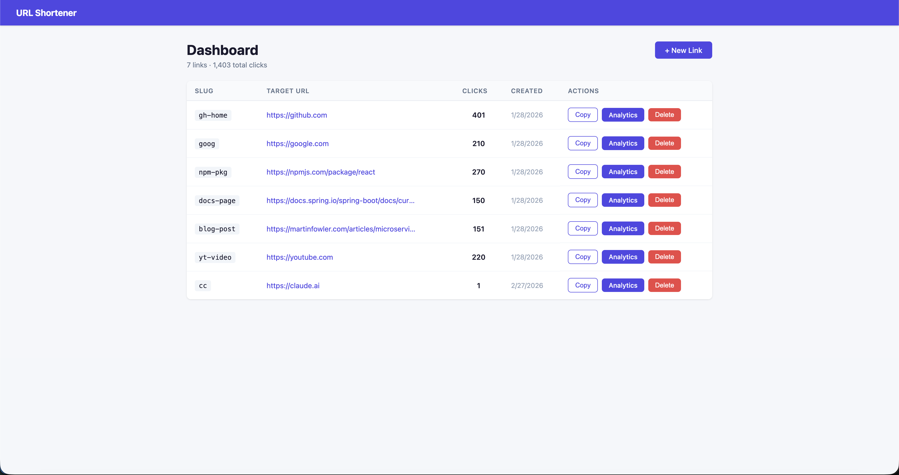
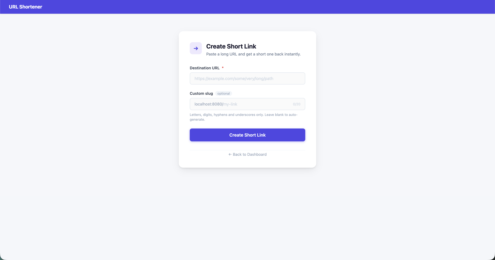
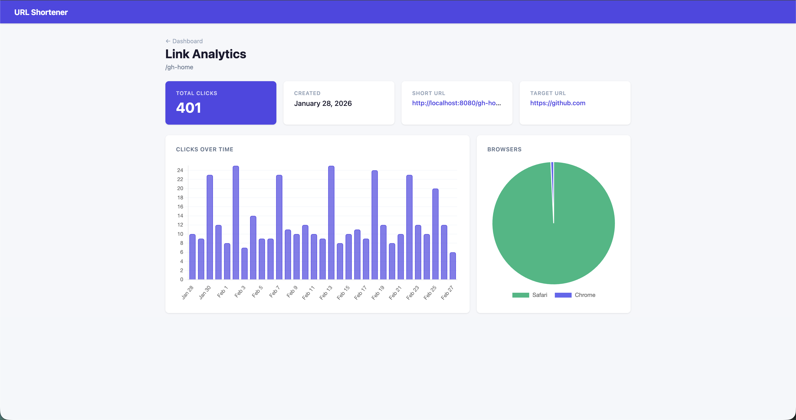

# URL Shortener with Click Analytics

A full-stack URL shortener with per-link click tracking and a daily analytics chart.







```
  Browser
     │
     ▼
┌─────────────────────┐        ┌──────────────────────────┐
│   nginx / React SPA │ fetch  │   Spring Boot API        │
│   Docker  → :80     │ ──────►│   Docker      → :8080    │
│   Dev     → :5173   │        │                          │
│                     │        │  POST /api/v1/links      │
│  Dashboard          │        │  GET  /api/v1/links      │
│  Create Link        │        │  GET  /{slug} → 302      │
│  Link Detail        │        │  GET  /api/v1/analytics  │
└─────────────────────┘        └──────────┬───────────────┘
                                           │ JPA / Flyway
                                           ▼
                                ┌──────────────────────────┐
                                │   PostgreSQL             │
                                │   Docker      → :5432    │
                                │   links table            │
                                │   click_events table     │
                                └──────────────────────────┘
```

## Stack

| Layer | Technology | Rationale |
|-------|-----------|-----------|
| Backend | Java 21 + Spring Boot 3.x | Type safety, mature ecosystem, Spring Data JPA eliminates boilerplate |
| Database | PostgreSQL 16 + Flyway | Reliable RDBMS; versioned migrations keep schema changes auditable |
| Frontend | Vite + React 18 + TypeScript | Fast dev experience; TypeScript prevents runtime type errors |
| Charts | Chart.js / react-chartjs-2 | Lightweight, well-documented bar chart support |
| Testing | JUnit 5 + Mockito + MockMvc + H2 | Standard Spring Boot test stack; H2 avoids Docker dependency in CI |

## Project Structure

```
Url-Shortener/
├── docker-compose.yml              # Starts db + backend + frontend
├── server/                         # Spring Boot app
│   ├── Dockerfile                  # Multi-stage Maven → JRE Alpine
│   ├── pom.xml
│   └── src/
│       ├── main/java/com/urlshortener/
│       │   ├── controller/         # REST endpoints
│       │   ├── service/            # Business logic
│       │   ├── repository/         # Spring Data JPA
│       │   ├── model/              # JPA entities
│       │   ├── dto/                # Request/response records
│       │   └── exception/          # Global error handling
│       ├── main/resources/
│       │   ├── application.yml
│       │   ├── application-test.yml
│       │   └── db/migration/       # Flyway SQL migrations
│       └── test/java/com/urlshortener/
│           ├── controller/         # MockMvc integration tests
│           └── service/            # Mockito unit tests
└── client/                         # Vite + React SPA
    ├── Dockerfile                  # Multi-stage Node build → nginx Alpine
    ├── nginx.conf                  # Serves SPA, handles React Router fallback
    ├── package.json
    ├── vite.config.ts
    └── src/
        ├── api/client.ts           # Typed fetch wrapper
        ├── pages/                  # Dashboard, CreateLink, LinkDetail
        └── components/             # LinkTable, DailyChart, UserAgentChart
```

## API Reference

| Method | Path | Description |
|--------|------|-------------|
| `POST` | `/api/v1/links` | Create a short link |
| `GET` | `/api/v1/links` | List all links |
| `GET` | `/api/v1/links/{id}` | Get a single link |
| `DELETE` | `/api/v1/links/{id}` | Delete a link |
| `GET` | `/{slug}` | Redirect (302) and record click |
| `GET` | `/api/v1/analytics/{id}/clicks` | Total click count |
| `GET` | `/api/v1/analytics/{id}/clicks/daily` | Clicks grouped by day |
| `GET` | `/api/v1/analytics/{id}/clicks/user-agents` | Click breakdown by browser type |

**Create link request:**
```json
{ "targetUrl": "https://example.com", "slug": "my-link" }
```
`slug` is optional — omit to auto-generate an 8-character alphanumeric slug.

**Error response shape:**
```json
{ "status": 404, "error": "Not Found", "message": "Slug 'xyz' does not exist" }
```

## Setup & Running

### Docker Compose (recommended)

The only prerequisite is [Docker Desktop](https://www.docker.com/products/docker-desktop/).

```bash
# Build images and start all three services
docker compose up --build

# Run in the background
docker compose up --build -d

# View logs (when running detached)
docker compose logs -f

# Stop containers (data volume preserved)
docker compose down

# Stop and delete the database volume
docker compose down -v
```

| Service | URL |
|---------|-----|
| Frontend | http://localhost |
| Backend API | http://localhost:8080 |
| PostgreSQL | localhost:5432 |

Flyway migrations and seed data run automatically on first startup. The `postgres_data` named volume persists data across restarts.

---

### Local Development

Requires Java 21, Maven 3.9+, Node.js 20+, and Docker.

```bash
# 1. Start only the database
docker compose up db -d

# 2. Start the backend (new terminal)
cd server
mvn spring-boot:run

# 3. Start the frontend dev server (new terminal)
cd client
npm install
npm run dev
```

| Service | URL |
|---------|-----|
| Frontend (Vite HMR) | http://localhost:5173 |
| Backend API | http://localhost:8080 |

### Tests

```bash
cd server
mvn test
```

Uses H2 in-memory — no running database needed.

## Key Design Decisions

**Async click recording** — Redirects record click events via `@Async` so the `GET /{slug}` response is never delayed by a database write. Click recording is best-effort; a failure in the async task does not affect the redirect.

**URL deduplication** — Submitting a URL that already exists returns the existing link rather than creating a duplicate record. The requested custom slug is ignored in this case. This keeps the link list clean and makes `POST /api/v1/links` safe to call repeatedly.

**Flyway migrations** — Schema is managed as versioned SQL files (`V1__create_schema.sql`, `V2__seed_data.sql`) rather than `ddl-auto: create`, ensuring every environment (local, CI, production) starts from an identical baseline and changes are auditable in version control.

**Slug generation** — Slugs are 8-character substrings of a random UUID (hex). The DB unique constraint is the authoritative guard; the service retries up to 5 times on collision before failing.

**H2 for tests** — Avoids requiring a running PostgreSQL instance in CI while still exercising the full Spring stack via MockMvc. The trade-off is that H2's dialect can differ from PostgreSQL's in edge cases, particularly around timestamp casting.

## Assumptions

- **Single-host deployment** — No load balancer or distributed cache. Slug uniqueness is enforced by the database unique constraint, which is the correct guard at any scale.
- **No authentication** — All links and analytics are publicly accessible. Any user can create, view, or delete any link.
- **URL deduplication is global** — The first slug assigned to a URL is permanent. A second request for the same URL always returns the original record, regardless of what custom slug is requested.
- **Analytics timezone** — Timestamps are stored as `TIMESTAMPTZ`. Daily grouping uses `CAST(clickedAt AS LocalDate)` in JPQL, which resolves to the JVM's local timezone — not guaranteed to be UTC unless the server is configured that way.
- **Click recording is best-effort** — The `@Async` fire-and-forget approach means a click may go unrecorded if the thread pool is saturated or the application restarts mid-flight. Exact click counts are not guaranteed.

## Future Improvements

- **Paginate `listLinks()`** — `findAll()` loads every link into memory. Spring Data's `Pageable` would bound memory use and response size as the link count grows.
- **Configure `ThreadPoolTaskExecutor` for `@Async`** — Spring's default `SimpleAsyncTaskExecutor` creates a new thread per task rather than using a pool. Under high redirect traffic this creates unbounded threads; a fixed `ThreadPoolTaskExecutor` with a queue caps resource usage.
- **HikariCP connection pool tuning** — The default pool size of 10 saturates quickly under concurrent load. Explicit sizing (typically `2 × CPU cores` as a baseline) prevents request queuing at the DB layer.
- **Composite index `(link_id, clicked_at)`** — The daily analytics query filters by `link_id` and groups by date. Separate indexes on each column are less efficient than a single composite index for this access pattern.
- **Pre-classify browser type at insert time** — The user-agent breakdown uses `LIKE '%Chrome%'` style patterns which cannot be indexed. Storing a pre-computed `browser_type` column on `click_events` at insert time would allow a simple indexed `GROUP BY` instead.
- **Test containers** — Replace H2 with a real PostgreSQL instance in tests to catch dialect differences, particularly the timezone behaviour of `CAST(clickedAt AS LocalDate)` which H2 may handle differently.
- **Redis caching** — Cache hot slug → target URL lookups to reduce DB reads on popular links and bring redirect latency below 1 ms.
- **Materialized view / scheduled job** — Pre-aggregate daily click counts for large datasets to avoid full-table GROUP BY queries on the analytics endpoints.
- **Click deduplication / bot filtering** — Track IP or fingerprint per session to avoid inflating counts from crawlers and repeated automated requests.
- **Short link expiry** — Add an optional `expires_at` column to `links`; return 410 Gone after expiry rather than silently redirecting or 404ing.
- **Authentication** — JWT-based auth so users can only manage their own links, with analytics scoped to the owner.
- **Rate limiting** — Prevent abuse of the link creation and redirect endpoints; especially important without authentication.

## LLM Prompts Used During Design

- "Lets make a plan for a  production-grade URL shortener REST API with click analytics — Ask me any question you need around tech stack and architecture choices"
- "We have the data for displaying a chart with the user agent breakdown. Lets add that data to the analytics page in a pie chart format."
